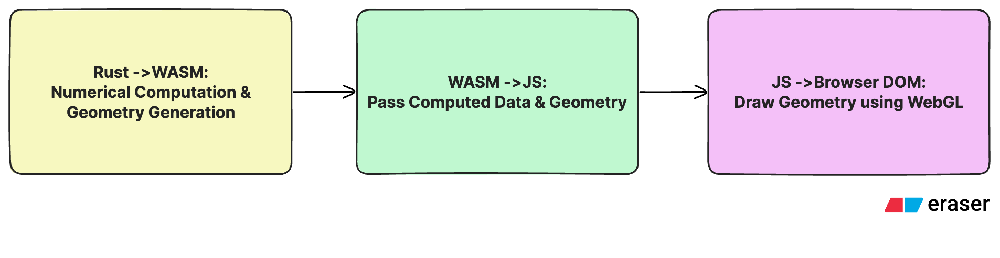
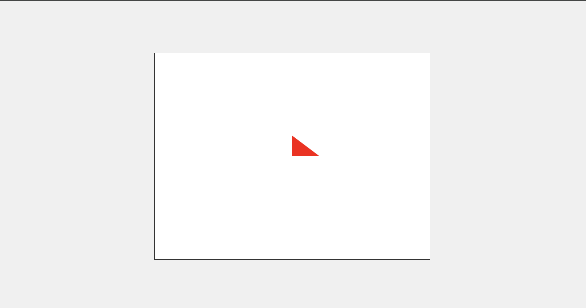

# Drawing Your First Triangle with WebGL: A Practical Guide

In my [previous article](https://medium.com/@dodziraynard/building-motion-from-scratch-my-journey-into-technical-video-animations-40689643a1a4), I explored why I chose to build a technical video editor using Rust and WebGL2. Today, we will get hands-on by setting up our development environment and rendering our first geometric shape on the canvas.

## The Challenge: Bridging Rust and the Browser

Here is the interesting problem: WebGL is a JavaScript API, which means we cannot interact with it directly from Rust. Additionally, browsers are not designed to execute arbitrary binaries for security reasons. The solution? **WebAssembly** — our bridge between Rust and the browser's WebGL API.

Below is the architecture we are working towards. In this article, we will focus specifically on the final component: **Drawing Geometry Using WebGL**.



## Before We Begin

My goal with this series is not to provide a comprehensive tutorial on each individual technology, but rather to show you how to compose them effectively to build a web-based technical video tool. If you are new to WebGL, I highly recommend these excellent resources:
- [WebGL Fundamentals](https://webglfundamentals.org/webgl/lessons/webgl-fundamentals.html)
- [MDN WebGL API Documentation](https://developer.mozilla.org/en-US/docs/Web/API/WebGL_API)

** Complete Source Code**: All code examples in this article are available on GitHub: [graphics-articles/24-12-2025-webgl-for-technical-communication-videos](https://github.com/dodziraynard/graphics-articles/tree/master/24-12-2025-webgl-for-technical-communication-videos)

## Understanding the WebGL Pipeline

WebGL operates through a **shader-based rendering pipeline**. We interact with WebGL through the rendering context of an HTML canvas element. At the core of WebGL are **shaders**, programs that run directly on your GPU.

There are two essential types of shaders in WebGL:

1. **Vertex Shader**: Defines the geometry of your shape by processing each vertex. This shader runs once for every vertex in your shape, determining its position in space.

2. **Fragment Shader**: Determines the color of each pixel within the region defined by your vertices. This shader executes for every pixel that falls inside your shape's boundaries.

### Key Concepts: Attributes and Uniforms

Before we dive into code, let us clarify two important terms:
- **GPU Buffer**: A memory region on the GPU that stores vertex data (positions, colors, normals, etc.). Buffers allow efficient transfer of large amounts of data from CPU to GPU for rendering.
- **Attributes**: These specify how to extract data from GPU buffers and feed it to your vertex shader. Think of them as per-vertex data.
- **Uniforms**: Global variables that remain constant across all shader executions for a single draw call. Perfect for things like transformation matrices or colors.

## Step 1: Setting Up the HTML Canvas

Let us start with a clean HTML template that includes our canvas element and basic styling:
```html
<html lang="en">
<head>
    <meta charset="UTF-8">
    <meta name="viewport" content="width=device-width, initial-scale=1.0">
    <title>WebGL Canvas</title>
    <style>
        body {
            margin: 0;
            padding: 0;
            display: flex;
            justify-content: center;
            align-items: center;
            min-height: 100vh;
            background-color: #f0f0f0;
        }
        canvas {
            border: 1px solid #333;
            background-color: white;
        }
    </style>
</head>
<body>
    <canvas id="canvas" width="800" height="600"></canvas>
    <script src="script.js"></script>
</body>
</html>
```

## Step 2: Writing the WebGL JavaScript Code

Now for the exciting part — our JavaScript code that brings everything to life. I have added detailed comments to explain each step of the process. 
```js
// Get the canvas and WebGL context
const canvas = document.getElementById('canvas');
const gl = canvas.getContext('webgl');

if (!gl) {
    console.error('WebGL not supported');
    alert('WebGL not supported in this browser');
}

// Vertex shader program
const vertexShaderSource = `
    attribute vec4 a_position;
    void main() {
        gl_Position = a_position;
    }
`;

// Fragment shader program
const fragmentShaderSource = `
    precision mediump float;
    void main() {
        gl_FragColor = vec4(1.0, 0.0, 0.0, 1.0); // Red color
    }
`;

// Function to create and compile a shader
function createShader(gl, type, source) {
    const shader = gl.createShader(type);
    gl.shaderSource(shader, source);
    gl.compileShader(shader);
    
    const success = gl.getShaderParameter(shader, gl.COMPILE_STATUS);
    if (success) {
        return shader;
    }
    
    console.error(gl.getShaderInfoLog(shader));
    gl.deleteShader(shader);
}

// Function to create a program from shaders
function createProgram(gl, vertexShader, fragmentShader) {
    const program = gl.createProgram();
    gl.attachShader(program, vertexShader);
    gl.attachShader(program, fragmentShader);
    gl.linkProgram(program);
    
    const success = gl.getProgramParameter(program, gl.LINK_STATUS);
    if (success) {
        return program;
    }
    
    console.error(gl.getProgramInfoLog(program));
    gl.deleteProgram(program);
}

// Create shaders
const vertexShader = createShader(gl, gl.VERTEX_SHADER, vertexShaderSource);
const fragmentShader = createShader(gl, gl.FRAGMENT_SHADER, fragmentShaderSource);

// Create program
const program = createProgram(gl, vertexShader, fragmentShader);

// Look up attribute location
const positionAttributeLocation = gl.getAttribLocation(program, 'a_position');

// Create a buffer for the triangle's positions
const positionBuffer = gl.createBuffer();
gl.bindBuffer(gl.ARRAY_BUFFER, positionBuffer);

// Triangle vertices: (0, 0), (0, 0.6), (0.6, 0)
const positions = [
    0.0, 0.0,
    0.0, 0.6,
    0.6, 0.0
];

gl.bufferData(gl.ARRAY_BUFFER, new Float32Array(positions), gl.STATIC_DRAW);

// Clear the canvas
gl.clearColor(0, 0, 0, 0);
gl.clear(gl.COLOR_BUFFER_BIT);

// Use the program
gl.useProgram(program);

// Enable the attribute
gl.enableVertexAttribArray(positionAttributeLocation);

// Bind the position buffer
gl.bindBuffer(gl.ARRAY_BUFFER, positionBuffer);

// Tell the attribute how to get data out of positionBuffer
const size = 2;          // 2 components per iteration
const type = gl.FLOAT;   // the data is 32bit floats
const normalise = false; // don't normalise the data
const stride = 0;        // 0 = move forward size * sizeof(type) each iteration
const offset = 0;        // start at the beginning of the buffer
gl.vertexAttribPointer(positionAttributeLocation, size, type, normalise, stride, offset);

// Draw the triangle
const primitiveType = gl.TRIANGLES;
const drawOffset = 0;
const count = 3;
gl.drawArrays(primitiveType, drawOffset, count);

```

### Breaking Down the Code

Let us understand what is happening here:

1. **WebGL Context Initialization**: We grab the canvas element and request its WebGL rendering context. Always include a fallback check for browsers that do not support WebGL.

2. **Shader Programs**: 
   - The vertex shader receives position data through the `a_position` attribute and sets `gl_Position`
   - The fragment shader sets `gl_FragColor` to red (1.0, 0.0, 0.0, 1.0 in RGBA format)

3. **Shader Compilation Pipeline**: Our helper functions `createShader()` and `createProgram()` handle the compilation and linking process. Always check for compilation errors — GPU error messages can be cryptic!

4. **Buffer Management**: We create a buffer to store our triangle's vertex positions. WebGL uses a normalized coordinate system where (0, 0) is the center, and coordinates range from -1 to 1.

5. **Rendering**: Finally, we configure the vertex attribute pointer, bind our data, and issue the draw call using `gl.drawArrays()`.

## The Result



Success! We have rendered a clean red triangle on our canvas.

## What is Next?

In this article, we have covered the fundamental WebGL rendering pipeline: creating shaders, managing buffers, and drawing basic geometry. This foundation is crucial for building more complex graphics applications.

In the next article, we will integrate WebAssembly and Rust into this setup, allowing us to leverage Rust's performance and type safety while maintaining the browser's graphics capabilities.

## Key Takeaways

- WebGL operates through a shader-based pipeline running on the GPU
- Vertex shaders define geometry, fragment shaders define appearance
- WebAssembly bridges the gap between Rust and browser APIs
- Always handle errors in shader compilation — debugging GPU code is challenging
- Understanding the buffer-to-attribute pipeline is essential for efficient rendering

## Resources

- **Source Code**: [View on GitHub](https://github.com/dodziraynard/graphics-articles/tree/master/24-12-2025-webgl-for-technical-communication-videos)
- **WebGL Fundamentals**: [webglfundamentals.org](https://webglfundamentals.org/webgl/lessons/webgl-fundamentals.html)
- **MDN WebGL API**: [developer.mozilla.org](https://developer.mozilla.org/en-US/docs/Web/API/WebGL_API)

---

*Building a technical video editor using web technologies? I am documenting my journey. Follow along for more insights into WebGL, Rust, and WebAssembly integration.*
